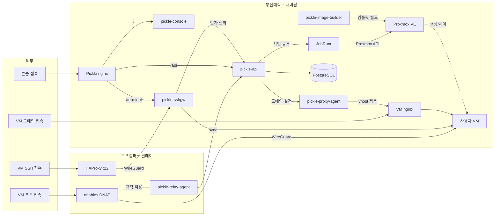

# pickle-secrets-example

부산대학교 클라우드 플랫폼(Pickle)의 호스트 시크릿 볼트가 어떻게 구성돼 있는지 보여주는
공개 예시본입니다. 실제 볼트는 비공개이며, 이 레포지토리에는 구조와 운용 절차만 옮겨
담았습니다.

> **이 레포지토리의 값은 전부 자리표시자입니다.** 키와 비밀번호, 토큰은 물론이고 도메인과
> 호스트명도 실제 값이 아닙니다.

## 풀려는 문제

호스트에는 앱이 읽는 자격증명 파일이 흩어져 있습니다. api의 env, Proxmox API 토큰, SSH
개인키, Origin CA 키. 서로 다른 컨테이너에 배포되지만 원본은 어딘가 한 곳에 있어야
합니다. 원본이 호스트 안에만 있으면 호스트 장애와 함께 사라져, 복구 시점에
무엇이 어떤 값이었는지 알 방법이 없습니다.

이 볼트는 git-crypt로 암호화한 상태로만 커밋하고, 복호화 키는 레포지토리 밖 오프라인에 둡니다. 커밋에는 암호문만 들어가므로 원격이
유출돼도 값은 드러나지 않고, 로컬 워킹트리는 평문이라 운용 절차는 그대로 쓸 수 있습니다.

## 주요 기능

이 볼트가 하는 일은 아래와 같습니다.

- **자격증명 보관**: 각 컨테이너에 배포되는 설정과 키의 원본을 한 곳에 두고 버전관리합니다.
- **평문 차단**: 등재된 경로는 암호문으로만 커밋됩니다.
- **복구**: 클론과 잠금 해제, 퍼미션 재적용만으로 원본을 되살립니다.
- **회전 추적**: 값이 바뀌면 커밋으로 남아, 언제 무엇을 돌렸는지 이력으로 따라갈 수
  있습니다.

## 구성

```
.gitattributes              어떤 경로를 암호화할지 정하는 단일 지점
.gitignore                  복호화 키 파일을 실수로 커밋하지 않도록 차단
api.env                     pickle-api 마스터 env          → 암호화
proxmox-token.json          Proxmox API 토큰                → 암호화
lightsail-ssh.pem           릴레이 SSH 개인키               → 암호화
sshgw-ssh_host_ed25519_key  게이트웨이 호스트키 백업        → 암호화
sshgw-upstream_ed25519_key  게이트웨이 → VM 홉 개인키       → 암호화
sshgw-terminal_ed25519_key  웹 터미널 브리지 개인키         → 암호화
origin-ca/<존>.key          존별 Origin CA 개인키           → 암호화
origin-ca/<존>.crt          대응 인증서                        평문 (공개물)
sshgw-*_ed25519_key.pub     대응 공개키                        평문 (공개물)
```

Origin CA 쌍은 **존마다 별도 파일**로 둡니다. 한 존의 쌍을 다른 존 것으로 덮어쓰면 앞의
쌍만 SAN에 담고 있던 이름이 조용히 인증서를 잃습니다.

`.gitattributes`는 **모양 규칙을 먼저** 둡니다(`*.key`·`*_key`·`*.pem`). 경로를 하나씩
등재하는 방식만 두면 목록에 없는 경로에 키를 넣는 순간 평문으로 커밋되고, 그 실패는
조용합니다 — 새 자격증명을 넣기 전에 가장 먼저 확인할 파일입니다.

이 레포지토리에는 위 중 `api.env`와 `proxmox-token.json`만 `.example` 접미사를 붙인
자리표시자로 들어 있습니다. 나머지는 키 파일이라 예시로 만들 내용이 없습니다.

## 셋업

```bash
git init
git-crypt init
# .gitattributes 작성 후
git-crypt export-key /path/to/vault.key   # 이 파일을 오프라인 매체에 보관
```

`export-key`로 뽑은 키는 레포지토리 밖으로 나가야 합니다. `.git/git-crypt/keys/default`에도
사본이 있지만 이 클론이 사라지면 같이 사라집니다. 키를 잃으면 어떤 클론도 복호화할 수
없습니다.

## 커밋이 암호문인지 확인하는 법

암호화된 블롭은 `\0GITCRYPT\0` 매직 헤더로 시작합니다. 원격에 push하기 전에 확인합니다.

```bash
git cat-file blob HEAD:api.env | head -c 10 | od -An -c
#  \0   G   I   T   C   R   Y   P   T  \0     ← 암호문
```

주석 줄이 기대하는 출력입니다. 다른 바이트가 나오면 그 파일은 평문으로 커밋된 것이므로
push하지 말고 `.gitattributes`부터 확인해야 합니다.

## 복구

```bash
git clone <remote> vault && cd vault
git-crypt unlock /path/to/vault.key
chmod 600 api.env proxmox-token.json lightsail-ssh.pem \
          sshgw-*_ed25519_key origin-ca/*.key
```

퍼미션 재적용이 절차의 일부입니다. git은 실행 비트 외의 파일 모드를 보존하지 않으므로
clone 직후 자격증명 파일은 0644로 떨어집니다.

## 운용에서 지키는 것

- 잠금 상태로 방치하지 않습니다. `git-crypt lock`을 걸어 두면 워킹트리가 암호문이 되어,
  평문을 기대하는 배포 스크립트가 잘못된 파일을 배포할 수 있습니다.
- 볼트와 라이브가 같은지 주기적으로 대조합니다. 키 이름 단위로 해시를 비교하면 값을
  노출하지 않고 확인할 수 있습니다.
- 회전은 볼트와 라이브를 같은 작업 단위에서 갱신합니다. 한쪽만 바꾸면 다음 복구가 옛
  값을 되살립니다. Proxmox 토큰처럼 두 파일에 같은 값이 들어가는 경우도 함께 갱신합니다.
- 평문 사본을 남기지 않습니다. 회전 중 만든 임시 백업은 대조가 끝나면 파기합니다.

## 실제 볼트와 다른 점

| 항목 | 실제 볼트 | 이 예시본 |
|---|---|---|
| 자격증명 값 | git-crypt 암호문으로 커밋 | 없음. 자리표시자 텍스트뿐 |
| 파일 이름 | `api.env`, `proxmox-token.json` | `.example` 접미사를 붙임 |
| 키 파일 | 5종 암호화 커밋 | 미포함 (예시로 만들 내용이 없음) |
| 도메인·호스트 | 실제 값 | `example.ac.kr` 등 예시 도메인 |
| git-crypt | 실제로 설정됨 | 설정하지 않음 (암호화할 대상이 없음) |

## 전체 아키텍처

<!-- arch:begin — 레포지토리 공통 블록입니다. 손으로 고치지 마세요. -->


| 레포지토리 | 역할 |
|---|---|
| [pickle-api](https://github.com/PNUops/pickle-api) | REST API와 프로비저닝 워커 (Spring Boot 4, Java 25, PostgreSQL 18, JobRunr) |
| [pickle-console](https://github.com/PNUops/pickle-console) | 사용자·관리자 웹 콘솔 (React 19, TypeScript) |
| [pickle-sshgw](https://github.com/PNUops/pickle-sshgw) | SSH 게이트웨이와 웹 터미널 브리지 (sshpiperd, Go) |
| [pickle-proxy-agent](https://github.com/PNUops/pickle-proxy-agent) | nginx 리버스 프록시 제어 에이전트 (Go) |
| [pickle-relay-agent](https://github.com/PNUops/pickle-relay-agent) | 오프캠퍼스 릴레이의 nftables DNAT 에이전트 (Go) |
| [pickle-image-builder](https://github.com/PNUops/pickle-image-builder) | 사용자 VM OS 이미지 빌드 레시피 (shell, virt-customize) |
| [pickle-infra](https://github.com/PNUops/pickle-infra) (비공개) | 인프라 프로비저닝 스크립트와 운영 런북 (shell) |
| [pickle-infra-example](https://github.com/PNUops/pickle-infra-example) | 프로비저닝·배포 스크립트와 런북 샘플 |
| [pickle-secrets](https://github.com/PNUops/pickle-secrets) (비공개) | 호스트 시크릿 볼트 (git-crypt) |
| [pickle-secrets-example](https://github.com/PNUops/pickle-secrets-example) | 볼트 레이아웃과 git-crypt 운용 절차 |
<!-- arch:end -->
